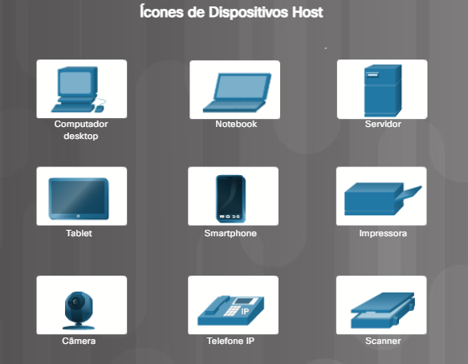
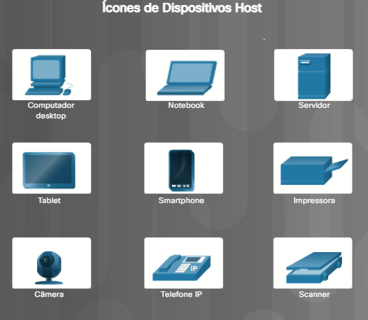
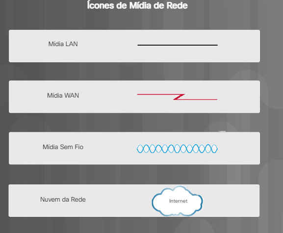

# HARE

## Curso Netacad - Hardware and Software

### Capítulo 2 - Montagem do PC

* É bom ter um extintor de incêndio por perto, mas nunca um extintor de água, pois obviamente vão danificar os componentes.

---

* Para colocar a fonte de alimentação:
    * I. Abrir a caixa do computador
    * II. Alinhar os orifícios dos parafusos na fonte de alimentação com as montagens do computador.
    * III. Aparafusar a fonte de alimentação no lugar.

* Gabinete:
    * O gabinete é escolhido levando em consideração a placa-mãe

* Ventoinhas: 
    * Componente muito importante, que ajuda o interior do gabinete a não superaquecer.
    * A direção do fluxo de ar criado por todos os ventiladores no gabinete deve trabalhar em conjunto para injetar ar mais frio e expulsar o ar mais quente. A instalação de uma ventoinha ao contrário ou o uso de ventoinhas de tamanho ou velocidade incorreta para o gabinete pode fazer com que os fluxos de ar se anulem.

* Fonte:
    * Pega a corrente da tomada (alternada) e converte em uma corrente contínua. Além de abaixar a tensão, para 3,3V, 5V ou 12V.

* Instalação do processador:
    * Pasta térmica: melhorar a dissipação de calor entre o processador e o cooler, depois de algum tempo a pasta seca e acaba virando uma barreira/película.

* Placa Mãe: 
    * Pensar em uma placa com 2 slots PCI express;
    * Levar em consideração o processador.

---

### Capítulo 3 - Hardware avançado de computador

---

* CMOS:
    * Todas as placas mãe precisam da BIOS para operar. E a BIOS é um programa armazenado no chip de memória ROM (CMOS) da placa mãe que contém um pequeno programa.
    * A bateria do CMOS serve para manter as configurações do computador mesmo ele estando desligado. É preciso trocá-la quando se tiver perdendo confingurações ao inicializá-lo.
    * POST:
        * Durante o POST, a BIOS executa uma verificação de hardware nos componentes principais para verificar se o hardware do computador está funcionando corretamente.
    * UEFI:
        * A UEFI define as mesmas configurações que a BIOS tradicional, mas também disponibiliza opções adicionais. Por exemplo, a UEFI pode fornecer uma interface de software habilitada para mouse em vez das telas tradicionais do BIOS.
    * É possível fazer algumas configurações de segurança para a BIOS, como senhas, criptografia e etc.

---

* Na hora de comprar uma placa mãe e um processador, é preciso ver se a BIOS da placa mãe é compatível com o processador, senão um não reconhece o outro.

---

* Potência e tensão:
    * Tensão (Volts) - é a medida do trabalho necessária para deslocar uma carga de um local para outro
    * Resistência (Ohms)
    * Corrente (Amperes)
    * Potência (Watts)

---

### Capítulo 4 - Manutenção preventiva e solução de problemas

---

### Manutenção preventiva
Localização ou ambiente do computador - Ambientes empoeirados, como canteiros de obras, requerem mais atenção do que um ambiente de escritório.
Uso do computador - redes de tráfego intenso, como a rede de uma escola, podem exigir varreduras e remoção adicionais de softwares mal-intencionados e arquivos indesejáveis.
	* Reduz possíveis problemas de hardware e software, tempo de inatividade do computador, custos de reparo e o número de falhas no equipamento;
	* Melhora a proteção de dados, a vida útil e a estabilidade do equipamento e economiza dinheiro.

---

#### Poeira

Para se previnir da poeira:
* Limpar e substituir os filtros de ar regularmente;
* Usar um pano para limpar o computador externamente;
* A poeira do lado de fora de um computador pode atravessar as ventoinhas de refrigeração para a parte interna;
* O pó acumulado evita o fluxo de ar e reduz o esfriamento dos componentes;
* Os componentes quentes do computador têm mais probabilidade de quebrar;
* Remova a poeira da parte interna do computador usando uma combinação de ar comprimido, um aspirador ESD de baixo fluxo de ar e um pequeno pano sem fiapos.
Mantenha a lata de ar comprimido na vertical para evitar que o fluido vaze nos componentes do computador;
* Mantenha o ar comprimido em uma distância segura de dispositivos e componentes sensíveis;
* Use o pano sem fiapos para remover qualquer poeira deixada no componente.

---

Componentes que merecem uma atenção a mais em relação à poeira:
* Dissipador de calor com ventoinha de CPU e Fan;
* Módulos de RAM;
* Parafusos;
* Placas de expansão;
* Dispositivos de energia;
* Teclado e mouse.

---

#### Preocupações ambientais
Instruções a se seguir para garantir o desempenho operacional do PC:
* Não obstrua ventoinhas ou o fluxo de ar a componentes internos;
* Mantenha a temperatura ambiente entre 45 e 90 graus Fahrenheit (7 a 32 graus Celsius);
* Mantenha o nível de umidade entre 10% e 80%;
* As recomendações de temperatura e umidade variam de acordo com o fabricante do computador. Pesquise os valores recomendados para computadores usados em condições extremas.

---

#### Software
Os softwares devem sempre se manter atualizados, até mesmo por questões de segurança, desempenho e outros aspectos.

---

#### Solução de problemas
* `` Backup ``:
    * O backup de dados é uma cópia dos dados do disco rígido de um computador salva em outro dispositivo de armazenamento ou armazenamento em nuvem. O armazenamento em nuvem é um armazenamento on-line acessado pela Internet. Em uma empresa, os backups podem ser realizados de forma diária, semanal ou mensal.

---

### Capítulo 5 - Conceitos de Redes

---

#### Ícones de rede
Redes são sistemas formados por links. As redes de computadores conectam dispositivos e usuários entre si. Uma variedade de ícones de rede é usada para representar diferentes partes de uma rede de computadores.

* Dispositivos Host:
    * Os dispositivos de rede com os quais as pessoas estão mais familiarizados são chamados de dispositivos finais ou dispositivos host (Figura 1). Eles são chamados de dispositivos finais, pois estão no fim ou na borda de uma rede

* Dispositivos Intermediários:
    * Esses dispositivos intermediários asseguram que os dados fluam de um dispositivo host para outro. Os dispositivos intermediários mais comuns são mostrados na Figura:

* Meio físico de rede:
    * A comunicação por uma rede é transmitida por um meio. Ele fornece o canal sobre o qual a mensagem viaja da fonte ao destino. O plural de meio é mídia. Os ícones na Figura 3 representam diferentes tipos de mídia de rede. 

